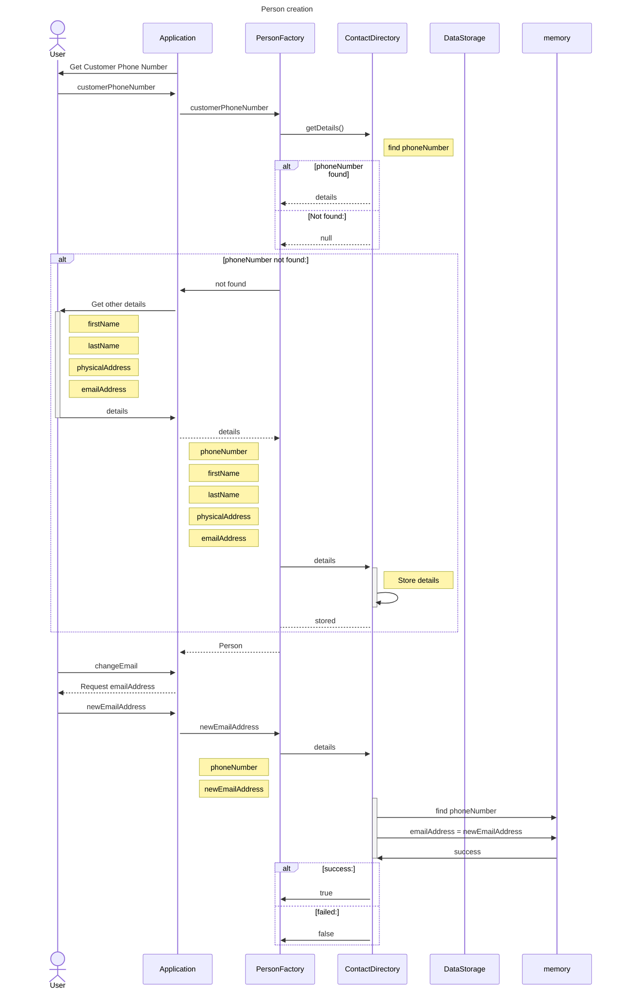

```mermaid
sequenceDiagram
    title Person creation
    actor usr as User
    participant app as Application
    participant personFactory as PersonFactory
    participant contactDirectory as ContactDirectory
    participant data as DataStorage
    app ->> usr: Get Customer Phone Number
    usr ->>+app: customerPhoneNumber
    app ->> personFactory: customerPhoneNumber
    personFactory ->>+contactDirectory: getDetails()
    Note right of contactDirectory: find phoneNumber
    alt phoneNumber found
        contactDirectory -->> personFactory: details
    else Not found:
        contactDirectory -->> personFactory: null
    end

    alt phoneNumber not found:
        personFactory ->> app: not found
        app ->>+usr: Get other details
        Note right of usr: firstName
        Note right of usr: lastName
        Note right of usr: physicalAddress
        Note right of usr: emailAddress
        usr ->>-app: details
        app -->> personFactory: details
        Note right of app: phoneNumber
        Note right of app: firstName
        Note right of app: lastName
        Note right of app: physicalAddress
        Note right of app: emailAddress
        personFactory ->>+contactDirectory: details
        Note right of contactDirectory: Store details
        contactDirectory ->>-contactDirectory: 
        contactDirectory --> personFactory: stored
    end
    personFactory -->> app: Person

    usr ->> app: changeEmail
    app -->> usr: Request emailAddress
    usr ->> app: newEmailAddress
    app ->> personFactory: newEmailAddress
    personFactory ->> contactDirectory: details
    Note left of personFactory: phoneNumber
    Note left of personFactory: newEmailAddress
    activate contactDirectory
    contactDirectory ->> memory: find phoneNumber
    contactDirectory ->> memory: emailAddress = newEmailAddress
    memory ->> contactDirectory: success
    deactivate contactDirectory
    alt success:
        contactDirectory ->> personFactory: true
    else failed:
        contactDirectory ->> personFactory: false
    end

```